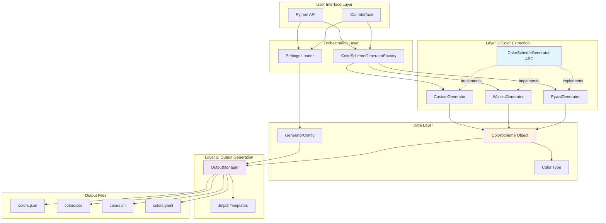

# High-Level Architecture

This diagram shows the overall architecture of the colorscheme_generator module.

## Key Components

### User Interface Layer
- **CLI Interface**: Command-line tool for generating color schemes
- **Python API**: Programmatic access to the module

### Orchestration Layer
- **Factory**: Creates backend instances based on selection/auto-detection
- **Settings Loader**: Loads and validates configuration from settings.toml

### Layer 1: Color Extraction
- **ColorSchemeGenerator ABC**: Abstract base class defining the interface
- **PywalGenerator**: Uses pywal for color extraction
- **WallustGenerator**: Uses wallust (Rust) for color extraction
- **CustomGenerator**: Pure Python implementation with PIL

### Data Layer
- **ColorScheme**: Complete color scheme with metadata
- **Color**: Single color in multiple formats (hex, RGB, HSL)
- **GeneratorConfig**: Runtime configuration

### Layer 2: Output Generation
- **OutputManager**: Renders templates and writes files
- **Jinja2 Templates**: Template files for each output format

### Output Files
- **JSON**: JSON format with colors and metadata
- **CSS**: CSS variables format
- **Shell**: Shell script with exported variables
- **YAML**: YAML format

