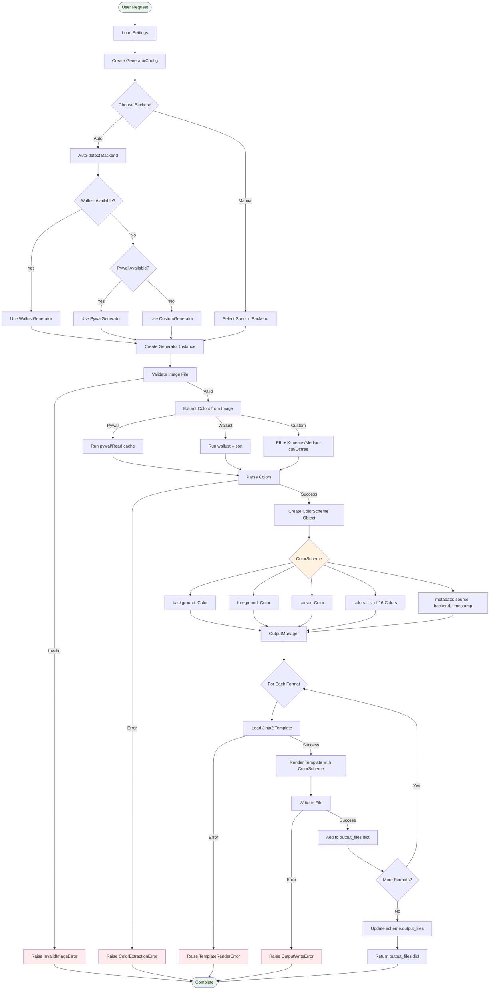

# Data Flow Diagram

This diagram shows how data flows through the system from image input to file output.

## Data Transformations

### Stage 1: Configuration
- **Input**: User request (image path, options)
- **Process**: Load settings.toml, merge with runtime overrides
- **Output**: GeneratorConfig object

### Stage 2: Backend Selection
- **Input**: Backend preference (or auto)
- **Process**: Check availability, create instance
- **Output**: ColorSchemeGenerator instance

### Stage 3: Color Extraction
- **Input**: Image file (PNG/JPG/etc.)
- **Process**: Backend-specific extraction algorithm
- **Output**: Raw color data

### Stage 4: Color Parsing
- **Input**: Raw color data (backend-specific format)
- **Process**: Parse and standardize colors
- **Output**: ColorScheme object with 16 colors + special colors

### Stage 5: Template Rendering
- **Input**: ColorScheme object + format selection
- **Process**: Render Jinja2 templates
- **Output**: Rendered content strings

### Stage 6: File Writing
- **Input**: Rendered content + output directory
- **Process**: Write files to disk
- **Output**: Dictionary of format → file path

