# Class Diagram

This diagram shows the class structure and relationships in the colorscheme_generator module.

```mermaid
classDiagram
    class ColorSchemeGenerator {
        <<abstract>>
        +generate(image_path, config) ColorScheme
        +is_available() bool
        +backend_name str
    }
    
    class PywalGenerator {
        -settings: AppConfig
        -cache_dir: Path
        +generate(image_path, config) ColorScheme
        +is_available() bool
        +backend_name str
        -_read_from_cache(image_path) ColorScheme
        -_run_pywal(image_path) ColorScheme
        -_parse_colors(colors_dict) ColorScheme
    }
    
    class WallustGenerator {
        -settings: AppConfig
        -wallust_path: Path
        +generate(image_path, config) ColorScheme
        +is_available() bool
        +backend_name str
        -_run_wallust(image_path) str
        -_parse_json(json_str) ColorScheme
    }
    
    class CustomGenerator {
        -settings: AppConfig
        +generate(image_path, config) ColorScheme
        +is_available() bool
        +backend_name str
        -_extract_colors_kmeans(image, n_colors) list
        -_extract_colors_median_cut(image, n_colors) list
        -_extract_colors_octree(image, n_colors) list
        -_assign_special_colors(colors) tuple
    }
    
    class ColorSchemeGeneratorFactory {
        <<factory>>
        +create(backend, settings) ColorSchemeGenerator
        +create_auto(settings) ColorSchemeGenerator
        +list_available(settings) list
    }
    
    class Color {
        +hex: str
        +rgb: tuple
        +hsl: tuple
        +from_hex(hex_str) Color
        +from_rgb(r, g, b) Color
        +to_dict() dict
    }
    
    class ColorScheme {
        +background: Color
        +foreground: Color
        +cursor: Color
        +colors: list~Color~
        +source_image: Path
        +backend: str
        +timestamp: datetime
        +output_files: dict
        +to_dict() dict
        +from_dict(data) ColorScheme
    }
    
    class GeneratorConfig {
        +output_dir: Path
        +formats: list~ColorFormat~
        +color_count: int
        +backend_options: dict
        +from_settings(settings, **overrides) GeneratorConfig
        +to_dict() dict
    }
    
    class OutputManager {
        -settings: AppConfig
        -template_dir: Path
        -env: Environment
        +write_outputs(scheme, output_dir, formats) dict
        -_render_template(template_name, context) str
        -_write_file(content, file_path) None
    }
    
    class AppConfig {
        +output: OutputSettings
        +generation: GenerationSettings
        +backends: BackendSettings
    }
    
    class OutputSettings {
        +directory: Path
        +formats: list~ColorFormat~
    }
    
    class GenerationSettings {
        +default_backend: Backend
        +color_count: int
    }
    
    class BackendSettings {
        +pywal: PywalSettings
        +wallust: WallustSettings
        +custom: CustomSettings
    }
    
    class ColorSchemeGeneratorError {
        <<exception>>
        +message: str
    }
    
    class BackendNotAvailableError {
        +backend: str
    }
    
    class ColorExtractionError {
        +image_path: Path
    }
    
    class TemplateRenderError {
        +template_name: str
    }
    
    class OutputWriteError {
        +file_path: Path
    }
    
    class InvalidImageError {
        +image_path: Path
    }
    
    ColorSchemeGenerator <|-- PywalGenerator : implements
    ColorSchemeGenerator <|-- WallustGenerator : implements
    ColorSchemeGenerator <|-- CustomGenerator : implements
    
    ColorSchemeGeneratorFactory ..> ColorSchemeGenerator : creates
    ColorSchemeGeneratorFactory ..> PywalGenerator : creates
    ColorSchemeGeneratorFactory ..> WallustGenerator : creates
    ColorSchemeGeneratorFactory ..> CustomGenerator : creates
    
    ColorSchemeGenerator ..> ColorScheme : returns
    ColorSchemeGenerator ..> GeneratorConfig : uses
    
    ColorScheme *-- Color : contains
    
    OutputManager ..> ColorScheme : uses
    OutputManager ..> GeneratorConfig : uses
    
    GeneratorConfig ..> AppConfig : from_settings
    
    AppConfig *-- OutputSettings : contains
    AppConfig *-- GenerationSettings : contains
    AppConfig *-- BackendSettings : contains
    
    ColorSchemeGeneratorError <|-- BackendNotAvailableError : extends
    ColorSchemeGeneratorError <|-- ColorExtractionError : extends
    ColorSchemeGeneratorError <|-- TemplateRenderError : extends
    ColorSchemeGeneratorError <|-- OutputWriteError : extends
    ColorSchemeGeneratorError <|-- InvalidImageError : extends
```

## Key Relationships

### Inheritance
- **PywalGenerator**, **WallustGenerator**, **CustomGenerator** all implement **ColorSchemeGenerator** ABC
- All custom exceptions inherit from **ColorSchemeGeneratorError**

### Composition
- **ColorScheme** contains multiple **Color** objects
- **AppConfig** contains **OutputSettings**, **GenerationSettings**, **BackendSettings**

### Dependencies
- **Factory** creates instances of **ColorSchemeGenerator** implementations
- **Generators** return **ColorScheme** objects
- **OutputManager** uses **ColorScheme** and **GeneratorConfig**
- **GeneratorConfig** is created from **AppConfig**

### Associations
- Generators use **GeneratorConfig** for runtime configuration
- **OutputManager** renders templates using **ColorScheme** data

