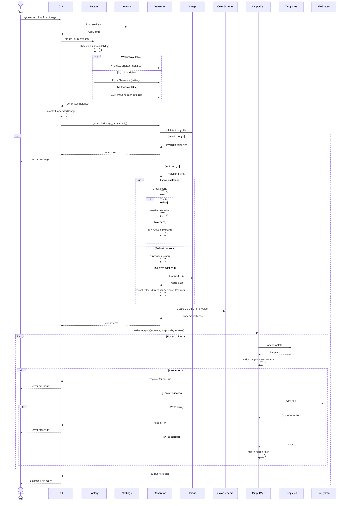

# Sequence Diagram

This diagram shows the sequence of interactions for generating a color scheme.

## Interaction Flow

### Phase 1: Initialization
1. User requests color generation
2. CLI loads settings from settings.toml
3. Factory auto-detects and creates appropriate backend
4. CLI creates runtime configuration

### Phase 2: Color Extraction
1. Generator validates image file
2. Backend-specific extraction:
   - **Pywal**: Check cache or run pywal
   - **Wallust**: Run wallust with JSON output
   - **Custom**: Load image with PIL and run algorithm
3. Parse colors into standardized format
4. Create ColorScheme object

### Phase 3: Output Generation
1. OutputManager receives ColorScheme
2. For each requested format:
   - Load Jinja2 template
   - Render template with color data
   - Write rendered content to file
3. Return dictionary of format → file path

### Phase 4: Completion
1. CLI receives output file paths
2. User is notified of success

