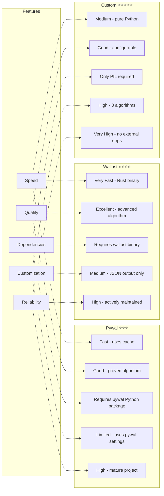
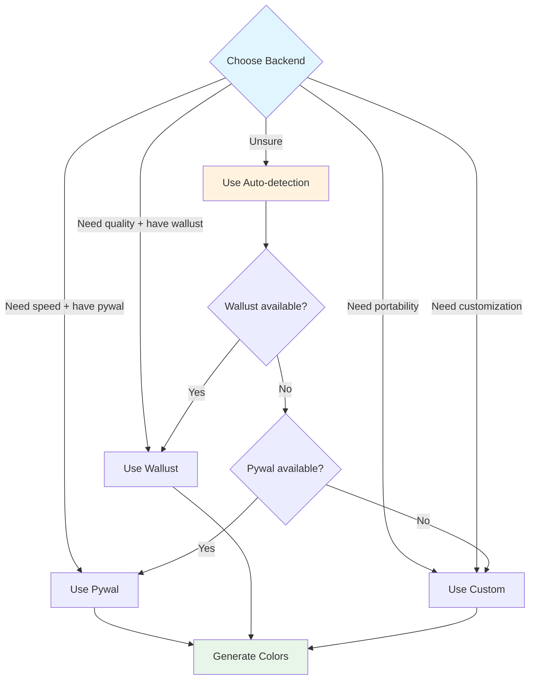

# Backend Comparison

This diagram compares the three backend implementations.

```mermaid
graph TB
    subgraph "Pywal Backend"
        P1[PywalGenerator]
        P2{Cache Exists?}
        P3[Read ~/.cache/wal/colors.json]
        P4[Run: wal -i image.png]
        P5[Parse JSON]
        P6[ColorScheme]
        
        P1 --> P2
        P2 -->|Yes| P3
        P2 -->|No| P4
        P3 --> P5
        P4 --> P5
        P5 --> P6
    end
    
    subgraph "Wallust Backend"
        W1[WallustGenerator]
        W2[Run: wallust --json image.png]
        W3[Capture stdout]
        W4[Parse JSON]
        W5[ColorScheme]
        
        W1 --> W2
        W2 --> W3
        W3 --> W4
        W4 --> W5
    end
    
    subgraph "Custom Backend"
        C1[CustomGenerator]
        C2[Load image with PIL]
        C3{Algorithm?}
        C4[K-means clustering]
        C5[Median-cut quantization]
        C6[Octree quantization]
        C7[Extract dominant colors]
        C8[Assign special colors]
        C9[ColorScheme]
        
        C1 --> C2
        C2 --> C3
        C3 -->|kmeans| C4
        C3 -->|median_cut| C5
        C3 -->|octree| C6
        C4 --> C7
        C5 --> C7
        C6 --> C7
        C7 --> C8
        C8 --> C9
    end
    
    style P1 fill:#e3f2fd
    style W1 fill:#f3e5f5
    style C1 fill:#e8f5e9
    style P6 fill:#fff3e0
    style W5 fill:#fff3e0
    style C9 fill:#fff3e0
```

## Feature Comparison

## Detailed Comparison Table

| Feature | Pywal | Wallust | Custom |
|---------|-------|---------|--------|
| **Language** | Python | Rust | Python |
| **Speed** | Fast (cached) | Very Fast | Medium |
| **Quality** | Good | Excellent | Good |
| **Dependencies** | pywal package | wallust binary | PIL only |
| **Algorithms** | 1 (pywal's) | 1 (wallust's) | 3 (k-means, median-cut, octree) |
| **Customization** | Low | Medium | High |
| **Cache Support** | Yes | No | No |
| **JSON Output** | Yes | Yes | N/A (internal) |
| **Reliability** | High | High | Very High |
| **Best For** | Quick generation with caching | High-quality colors, speed | Maximum portability, customization |

## Algorithm Details

### Pywal Algorithm
1. Reads from `~/.cache/wal/colors.json` if available
2. Otherwise runs `wal -i <image>` command
3. Pywal uses imagemagick for color extraction
4. Returns 16 colors + special colors

### Wallust Algorithm
1. Runs `wallust --json <image>` command
2. Wallust uses advanced color extraction (Rust implementation)
3. Captures JSON output from stdout
4. Parses colors and metadata

### Custom Algorithms

**K-means Clustering:**
- Groups pixels into K clusters
- Uses cluster centers as colors
- Fast and effective for most images

**Median-cut Quantization:**
- Recursively divides color space
- Finds median along longest axis
- Good for images with distinct color regions

**Octree Quantization:**
- Builds tree structure of colors
- Prunes tree to desired color count
- Excellent for gradients and smooth transitions

## When to Use Each Backend

