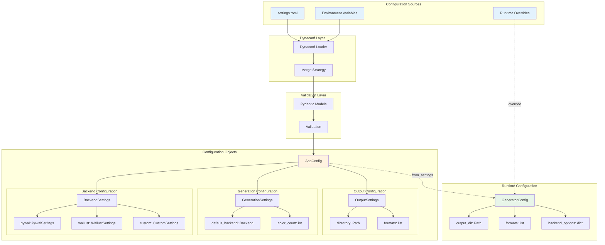
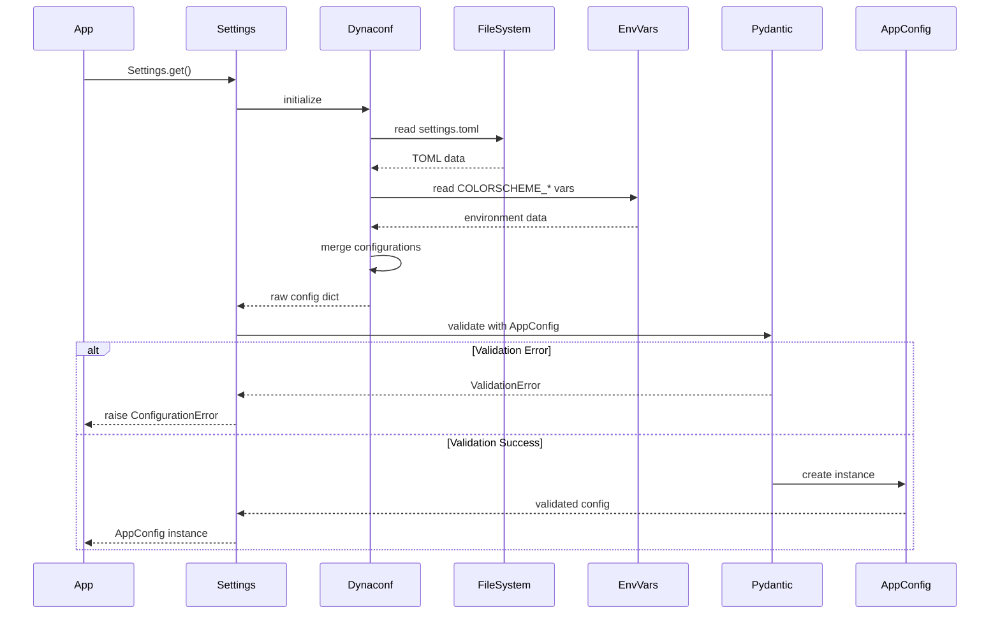
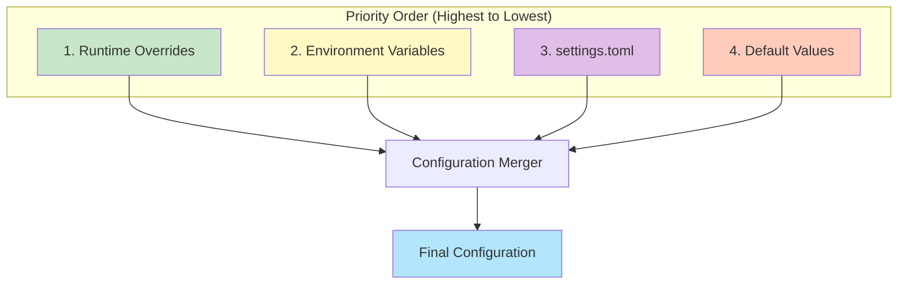
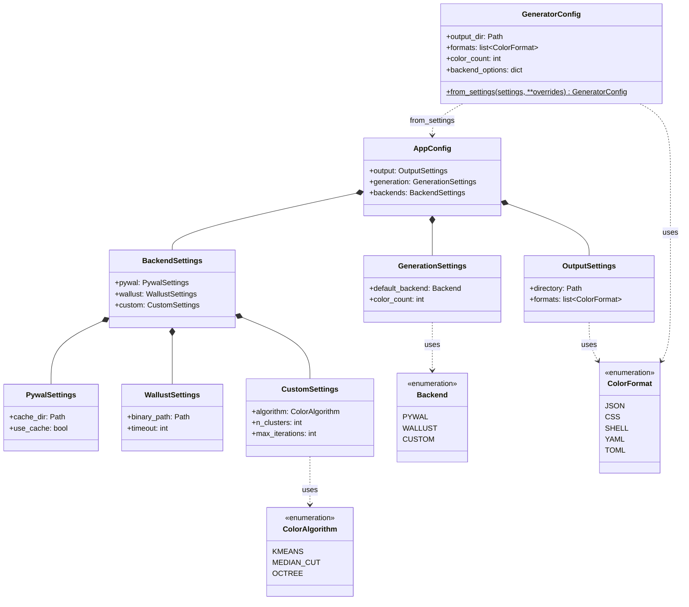
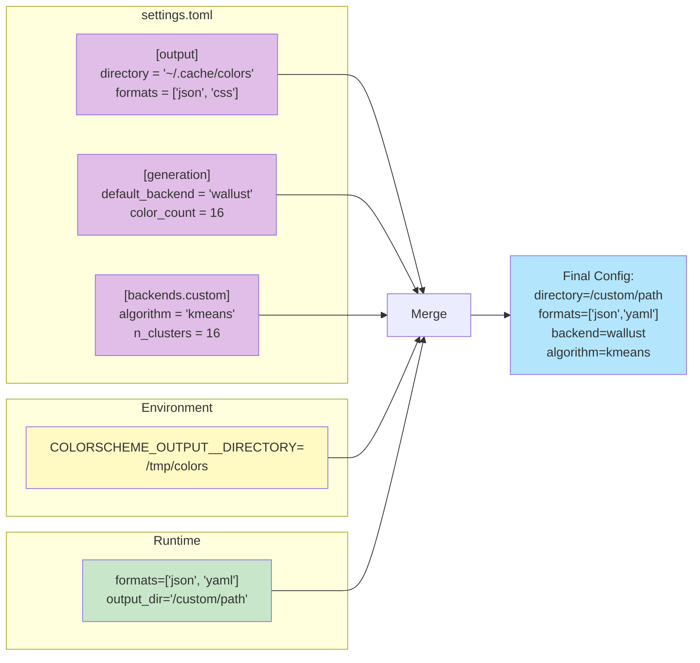

# Configuration System

This diagram shows the configuration hierarchy and loading process.

## Configuration Loading Process

## Configuration Hierarchy

## Configuration Schema

## Example Configuration Flow

