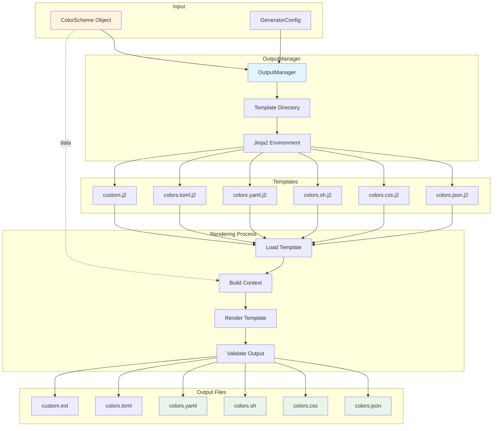
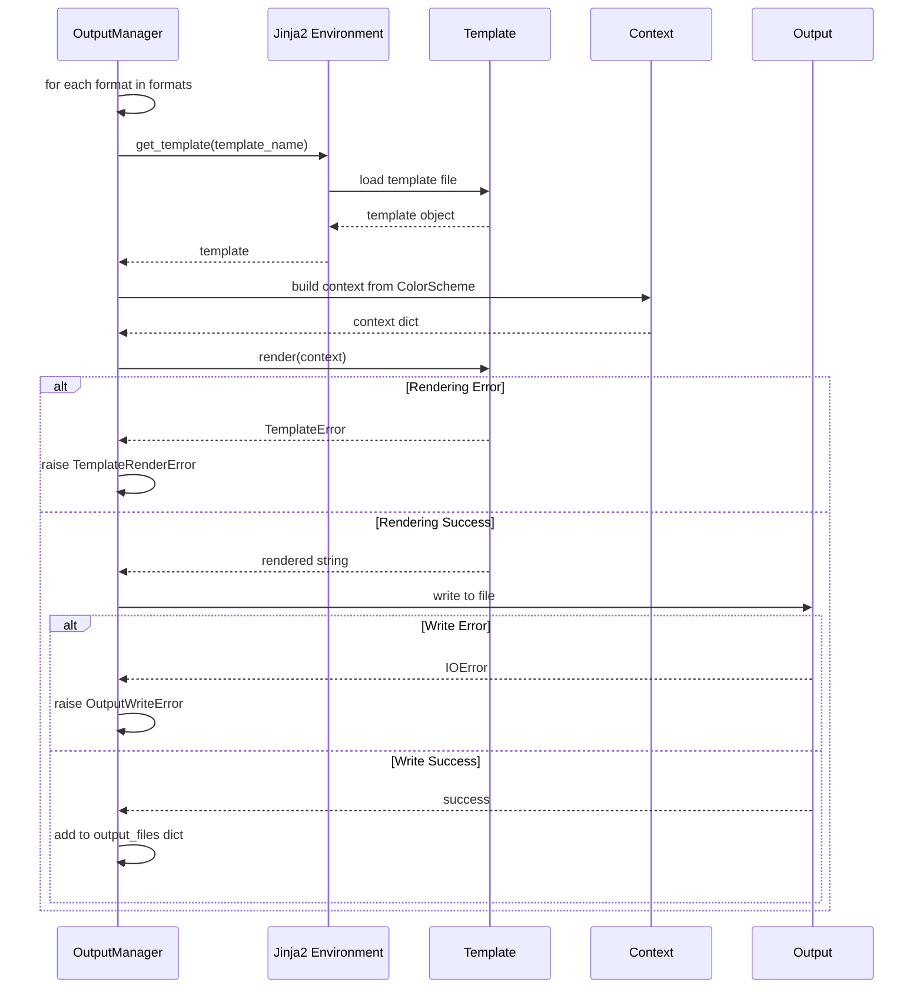
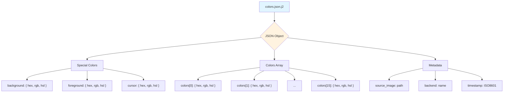
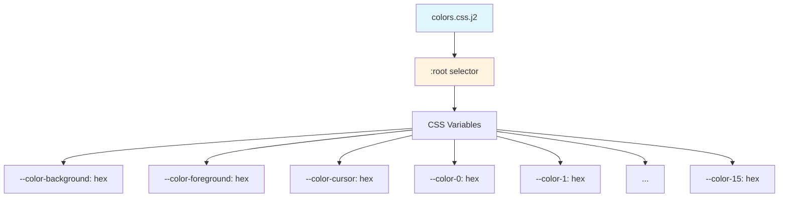
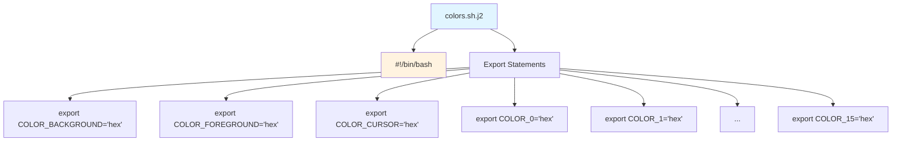
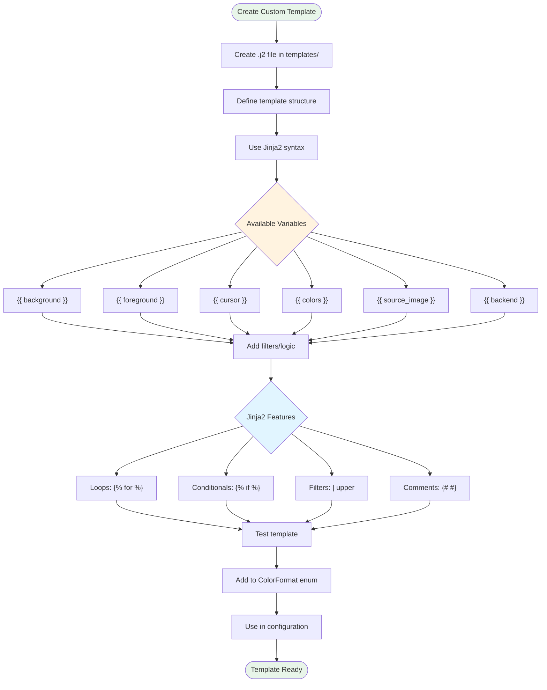
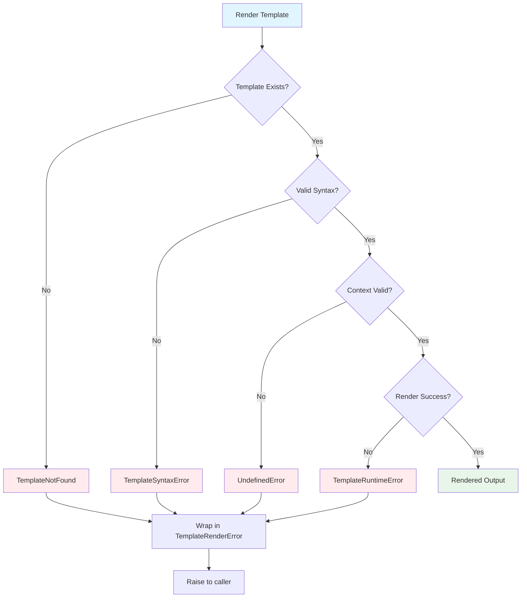

# Template System

This diagram shows how the Jinja2 template system works.



## Template Context

```mermaid
graph LR
    subgraph "ColorScheme Data"
        BG[background]
        FG[foreground]
        CUR[cursor]
        C0[colors[0]]
        C1[colors[1]]
        C15[colors[15]]
        SRC[source_image]
        BACK[backend]
        TIME[timestamp]
    end
    
    subgraph "Template Context"
        CTX[Context Dictionary]
    end
    
    subgraph "Available in Templates"
        T_BG["{{ background.hex }}"]
        T_FG["{{ foreground.rgb }}"]
        T_CUR["{{ cursor.hsl }}"]
        T_LOOP[""]
        T_SRC["{{ source_image }}"]
        T_BACK["{{ backend }}"]
    end
    
    BG --> CTX
    FG --> CTX
    CUR --> CTX
    C0 --> CTX
    C1 --> CTX
    C15 --> CTX
    SRC --> CTX
    BACK --> CTX
    TIME --> CTX
    
    CTX --> T_BG
    CTX --> T_FG
    CTX --> T_CUR
    CTX --> T_LOOP
    CTX --> T_SRC
    CTX --> T_BACK
    
    style CTX fill:#fff3e0
```

## Template Rendering Flow



## Built-in Templates

### JSON Template Structure


### CSS Template Structure


### Shell Template Structure


## Custom Template Creation



## Template Error Handling



