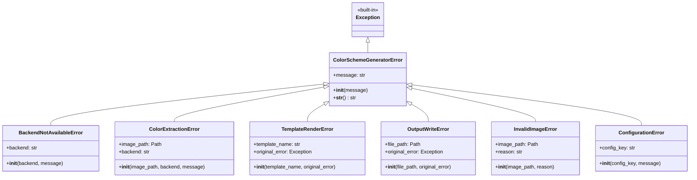
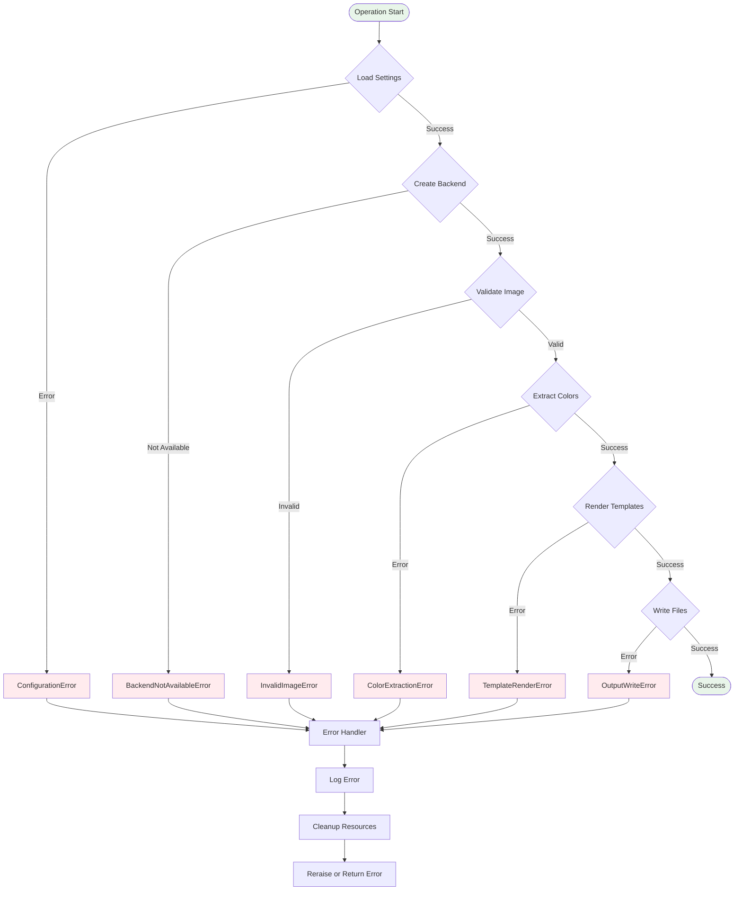
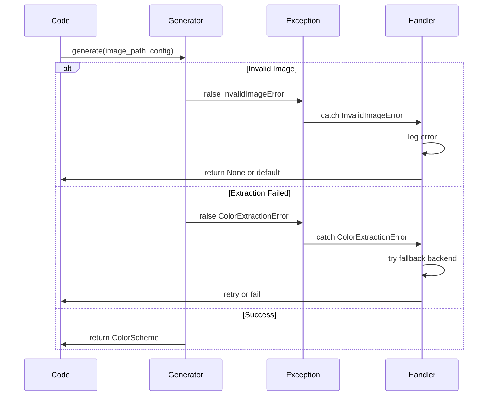
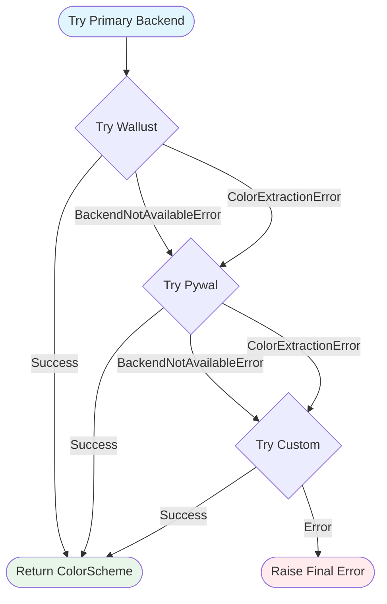
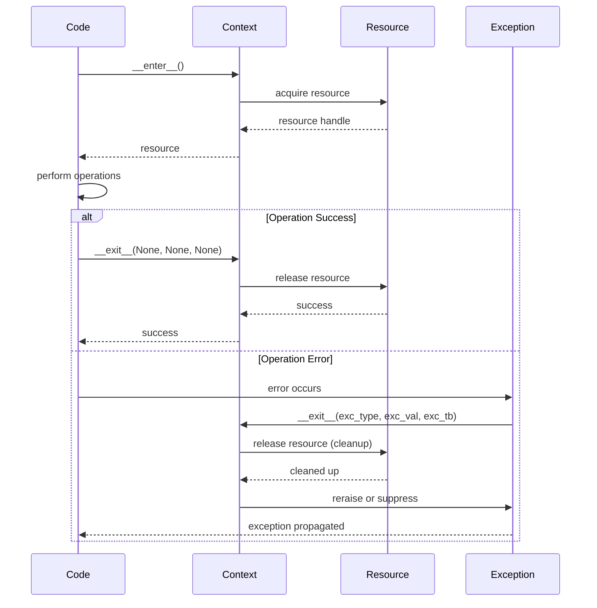
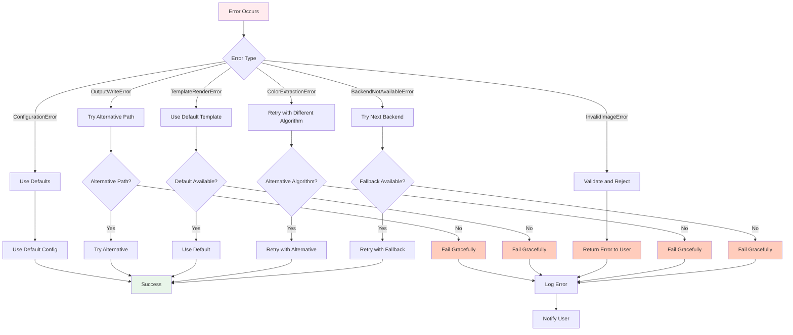
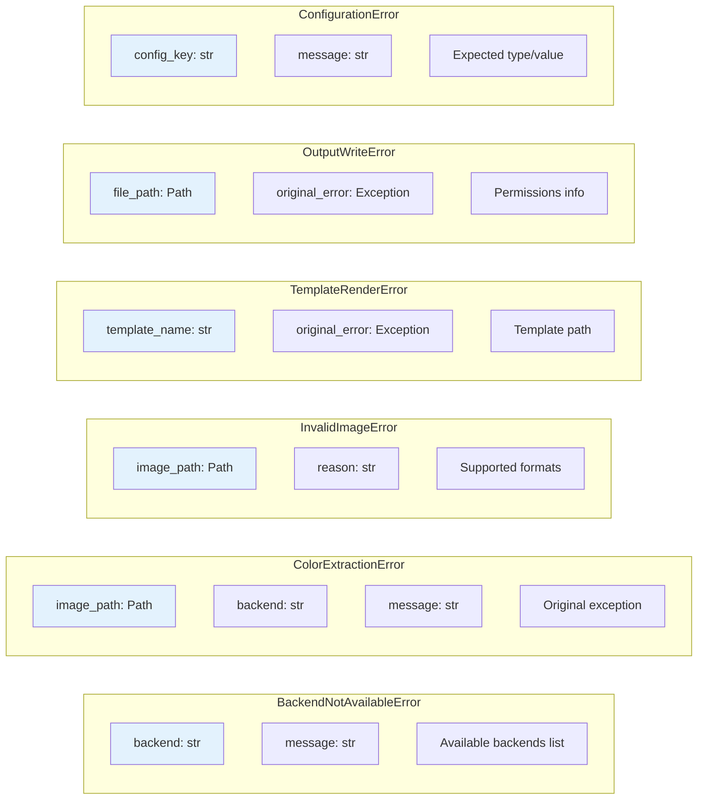
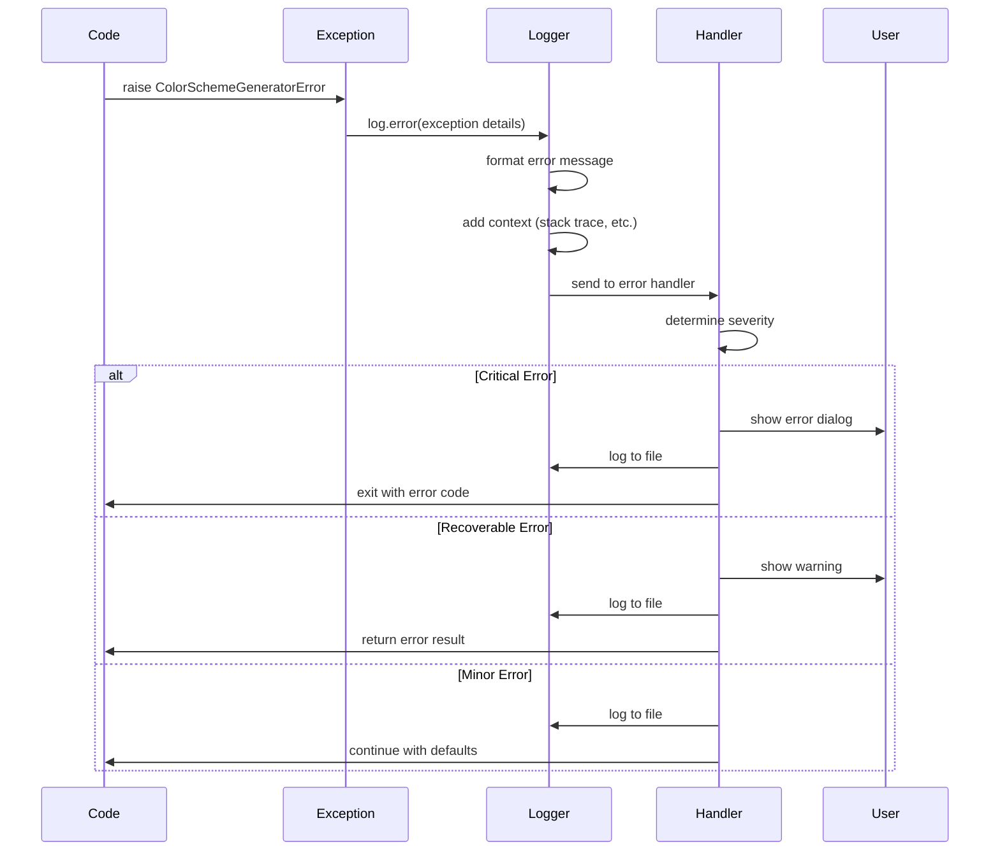

# Exception Hierarchy

This diagram shows the exception hierarchy and error handling flow.

## Error Flow Diagram

## Exception Handling Patterns

### Pattern 1: Try-Except with Specific Exceptions

### Pattern 2: Fallback Chain

### Pattern 3: Context Manager

## Error Recovery Strategies

## Exception Context Information

## Error Logging Flow

