# Integration Patterns

This diagram shows how the colorscheme_generator integrates with other systems.

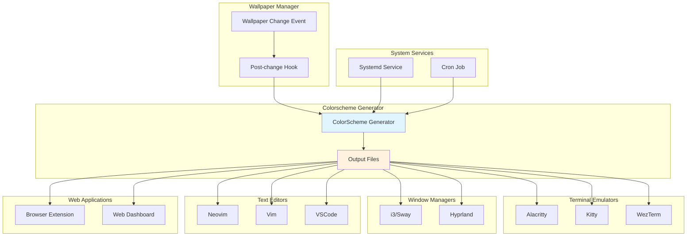

## Wallpaper Manager Integration

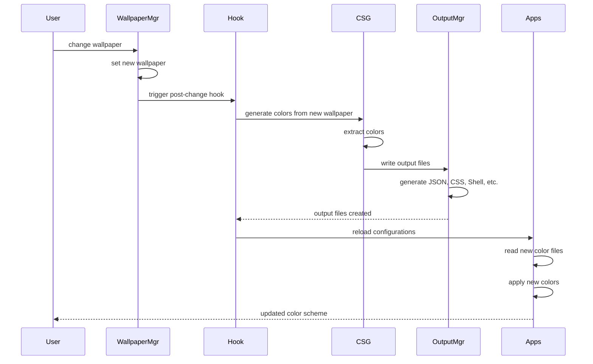

## Terminal Emulator Integration

### Alacritty Integration
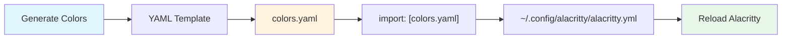

### Kitty Integration
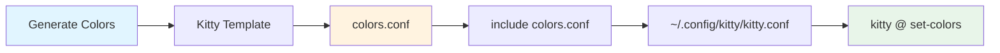

## Window Manager Integration

### i3/Sway Integration
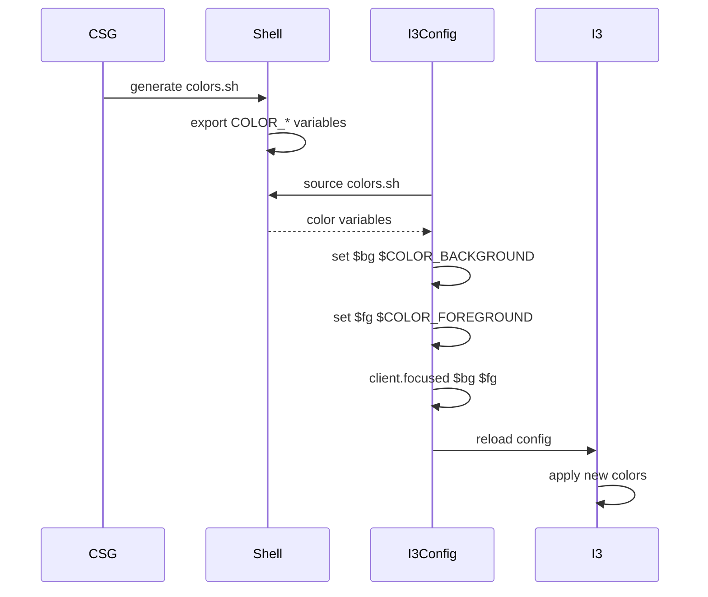

## Application Configuration Flow

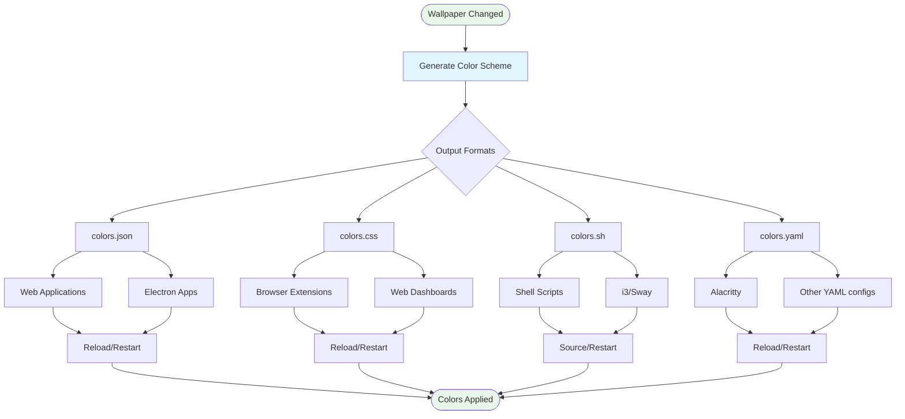

## Systemd Service Integration

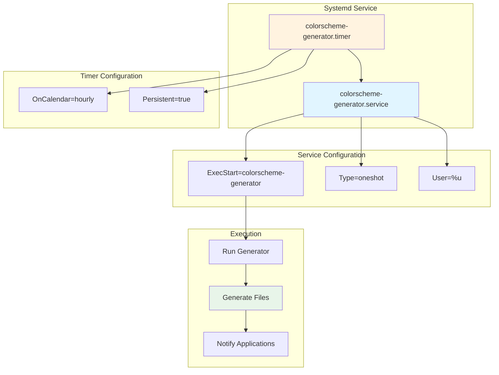

## Event-Driven Integration

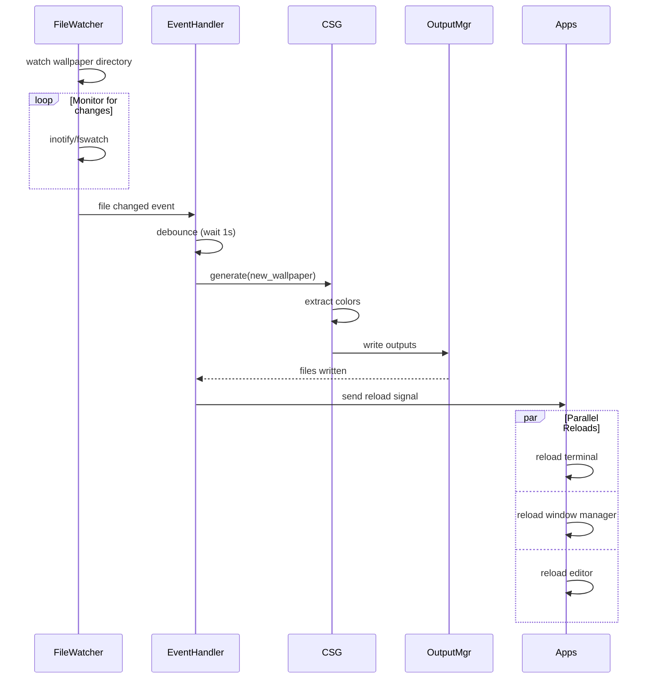

## API Integration Pattern

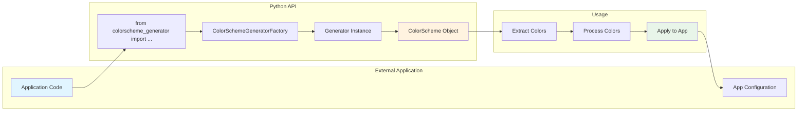

## Batch Processing Integration

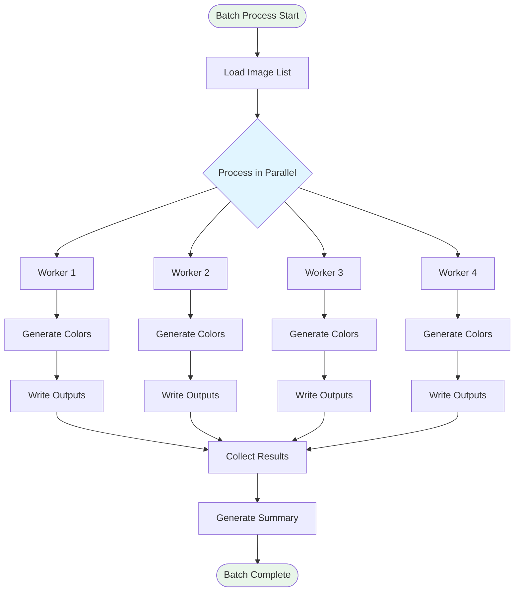

## Plugin Architecture

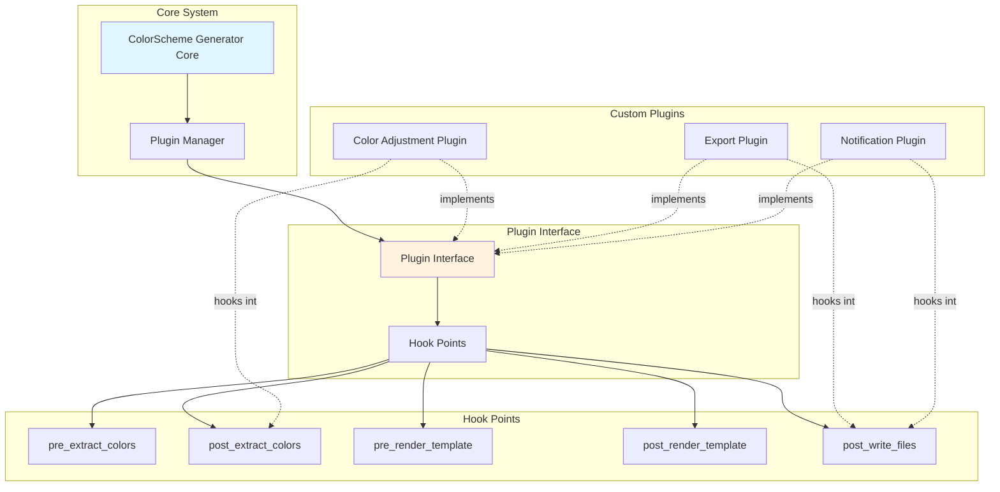

