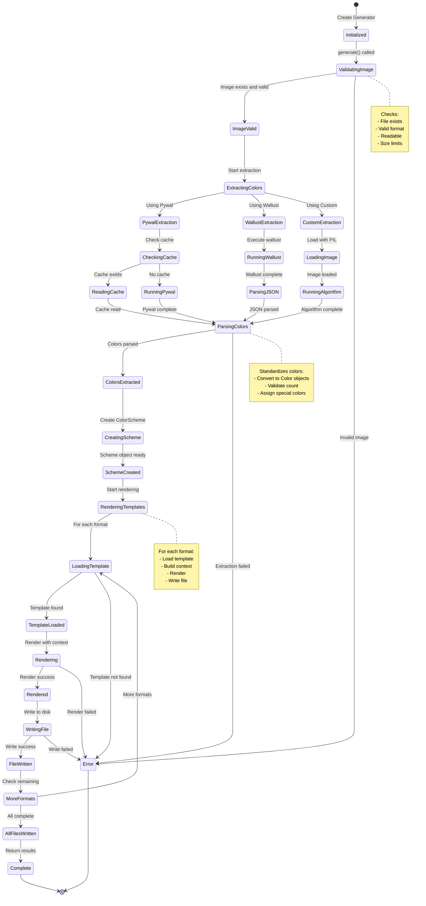
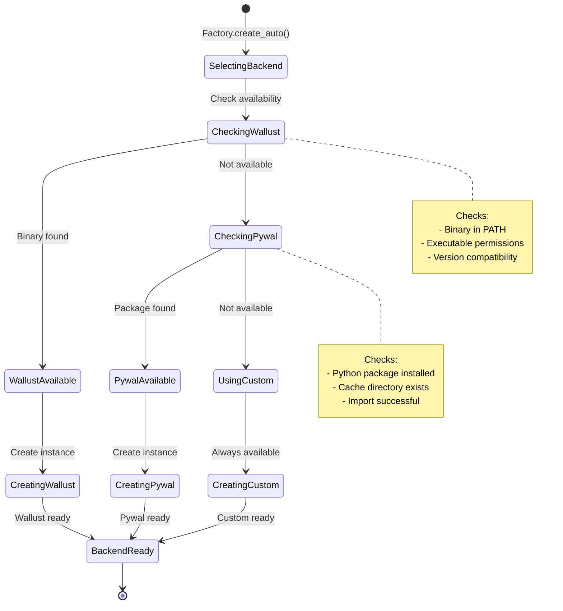
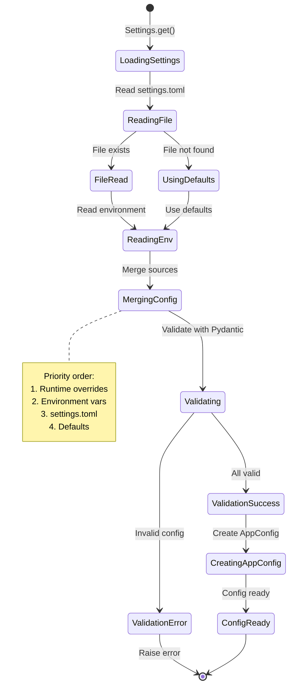
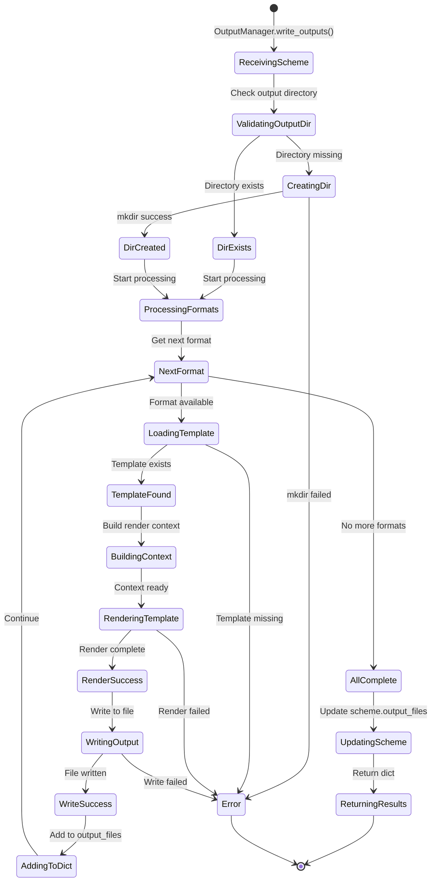
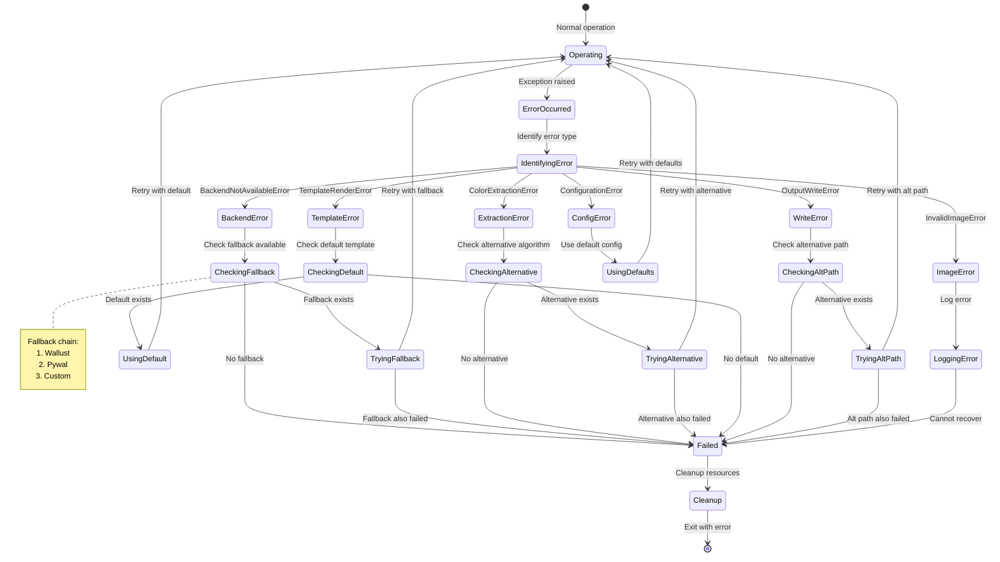
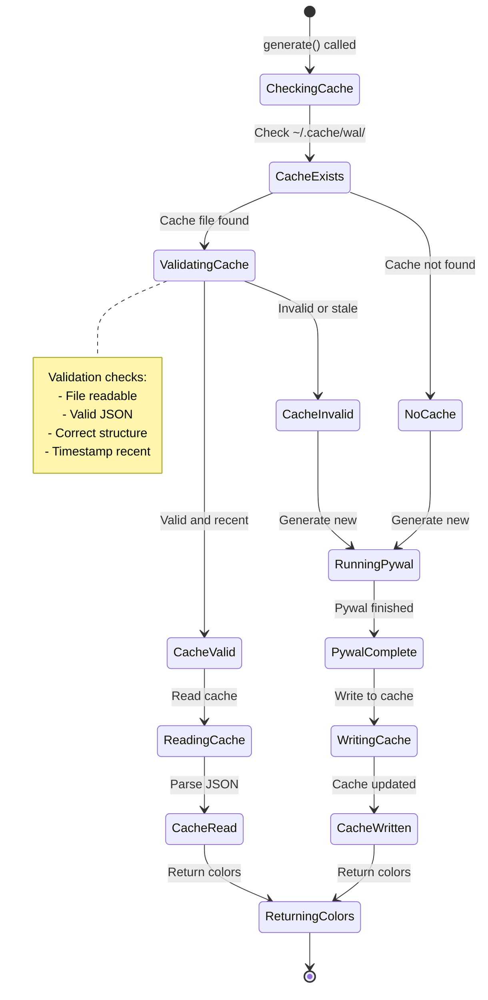
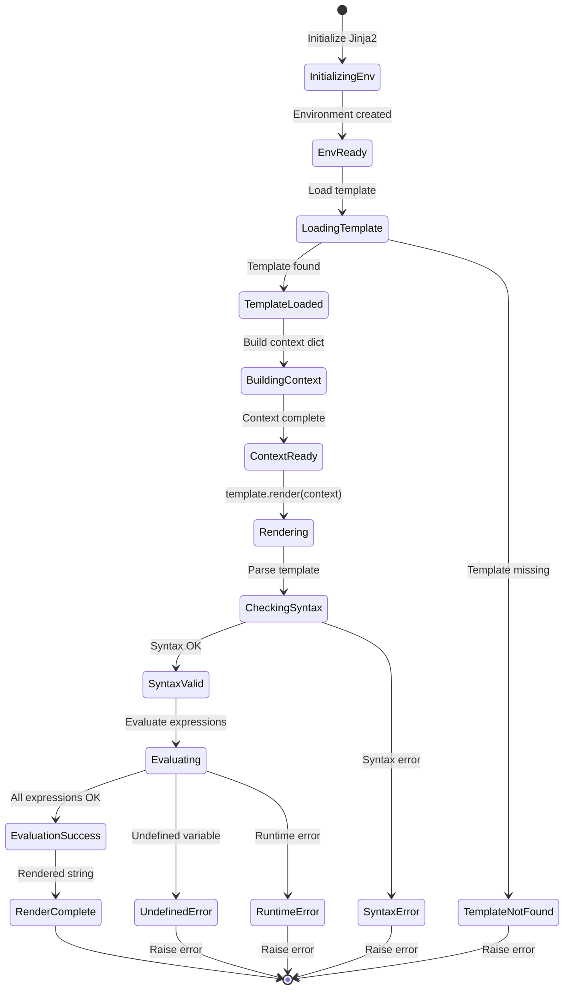

# State Machine Diagrams

This diagram shows the state transitions during color scheme generation.

## Backend Selection State Machine

## Configuration Loading State Machine

## Output Generation State Machine

## Error Recovery State Machine

## Cache State Machine (Pywal Backend)

## Template Rendering State Machine

